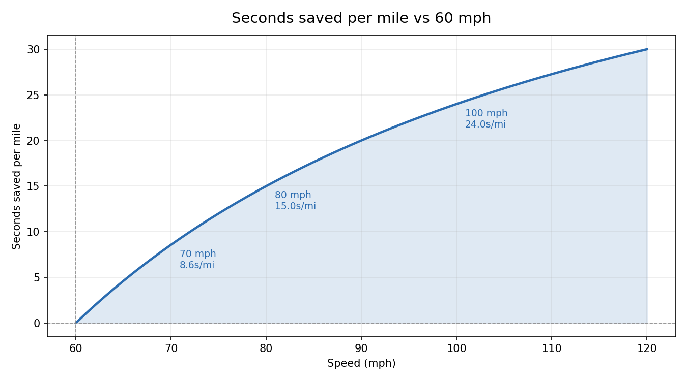

# Speed Over 60 Calculator

How much time do you save per mile when driving over 60 mph? At 60 mph you cover exactly **1 mile per minute** (60 seconds per mile). Every mph above 60 shaves a little time off each mile — this tool calculates how much.



## Two ways to use it

### Web (interactive)
Open `index.html` in any browser, or enable GitHub Pages on this repo to host it.

### Python CLI
```bash
python speed_calc.py 75 --trip 200
# Speed:               75.00 mph
# Miles per minute:    1.2500
# Seconds per mile:    48.00
# Sec saved per mile:  +12.00  (vs 60 mph)
# Trip (200.0 mi) time: 2h 40m 0.0s
# Time saved on trip:  40m 0.0s
```

Regenerate the chart and CSV:
```bash
python speed_calc.py --export --min 60 --max 120 --step 1
```

## What it shows

For every speed in a range you choose:

- **Miles per minute** — e.g. 70 mph = 1.1667 mi/min
- **Seconds per mile** — e.g. 70 mph = 51.43 sec/mile
- **Seconds saved per mile vs 60 mph** — e.g. 70 mph saves 8.57 sec/mile
- **Total time saved on a trip** — enter a trip distance and see the cumulative savings

## The math

| Quantity | Formula |
|---|---|
| Miles per minute | `mph / 60` |
| Seconds per mile | `3600 / mph` |
| Seconds saved per mile (vs 60 mph) | `60 − (3600 / mph)` |
| Trip time saved | `trip_miles × (60 − 3600/mph)` |

## Examples

| Speed | Miles/min | Sec/mile | Sec saved/mile | Saved on 100-mile trip |
|------:|----------:|---------:|---------------:|-----------------------:|
| 60    | 1.0000    | 60.00    | 0.00           | 0s                     |
| 65    | 1.0833    | 55.38    | 4.62           | 7m 41.5s               |
| 70    | 1.1667    | 51.43    | 8.57           | 14m 17.1s              |
| 80    | 1.3333    | 45.00    | 15.00          | 25m 0.0s               |
| 100   | 1.6667    | 36.00    | 24.00          | 40m 0.0s               |

## Files

- `index.html` — interactive web table (no dependencies, no build step)
- `speed_calc.py` — Python CLI for one-off queries and chart/CSV export
- `speeds.csv` — exported table for 60–120 mph in 1 mph steps
- `time_saved.png` — chart of seconds saved per mile vs speed

## Python requirements

The CLI uses only the standard library for queries. The `--export` chart needs matplotlib:

```bash
pip install matplotlib
```
