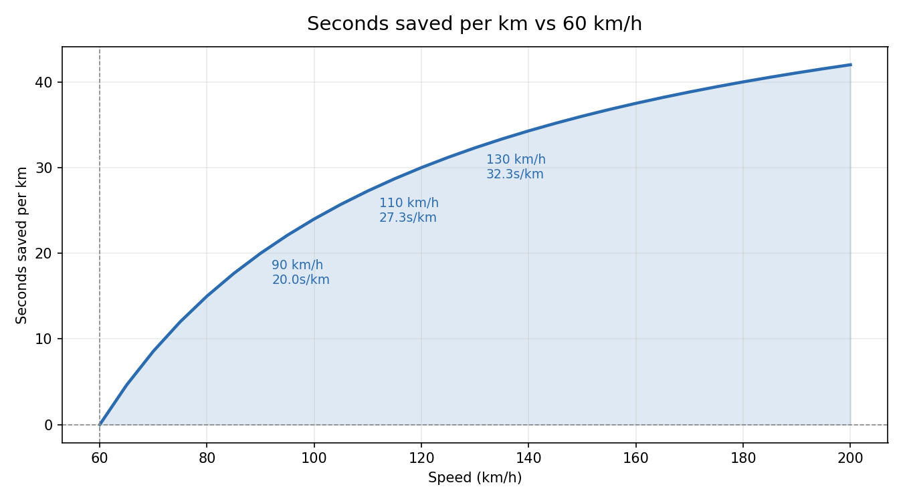

# Speed Over 60 Calculator

How much time do you save by driving over the speed limit? The math is unit-symmetric:

- At **60 mph** you cover exactly **1 mile per minute** (60 sec/mile).
- At **60 km/h** you cover exactly **1 km per minute** (60 sec/km).

Every unit of speed above 60 shaves a little time off each mile/km. This tool shows how much, in either system.

| Imperial | Metric |
|:---:|:---:|
|  |  |

## Three ways to use it

### Web (interactive table)
Open `index.html` in any browser. Use the **mph / km/h** toggle to switch units — all labels, headers, and the trip-distance input update on the fly.

### Live Mode (real-time GPS)
On a phone, open the hosted page (GitHub Pages — see below) and tap **▶ Start GPS**. You'll see:

- Huge current-speed readout (green when over 60, orange when under)
- Live `sec/mi` and `sec saved/mi` updating each second
- Running trip distance and total time saved this session
- Wake Lock keeps the screen on while tracking

**Setup on iPhone:**
1. Enable GitHub Pages: Settings → Pages → Source: `main` / root → Save
2. Wait ~1 min, then open the Pages URL in Safari (requires HTTPS for GPS)
3. **Share → Add to Home Screen** to install it as an app
4. Mount your phone, tap **Start GPS**, allow location

> ⚠ **Safety:** for passenger use or quick glances at a mounted screen. Do not interact with your phone while driving.

### Python CLI
```bash
# Miles per hour (default)
python speed_calc.py 75 --trip 200
# Speed:                  75.00 mph
# Miles per minute:       1.2500
# Seconds per mile:       48.00
# Sec saved per mile:     +12.00  (vs 60 mph)
# Trip (200.0 mile) time: 2h 40m 0.0s
# Time saved on trip:     40m 0.0s

# Kilometers per hour
python speed_calc.py 120 --trip 300 --unit km
# Speed:                  120.00 km/h
# Km per minute:          2.0000
# Seconds per km:         30.00
# Sec saved per km:       +30.00  (vs 60 km/h)
# Trip (300.0 km) time:   2h 30m 0.0s
# Time saved on trip:     2h 30m 0.0s
```

Regenerate charts and CSVs:
```bash
python speed_calc.py --export --unit mi --max 120
python speed_calc.py --export --unit km --max 200 --step 5
```

## The math (works for either unit)

| Quantity | Formula |
|---|---|
| Distance per minute | `speed / 60` |
| Seconds per unit distance | `3600 / speed` |
| Seconds saved per unit (vs 60) | `60 − (3600 / speed)` |
| Trip time saved | `trip_distance × (60 − 3600/speed)` |

## Examples

### mph (100-mile trip)
| mph | mi/min | sec/mi | saved/mi | saved on trip |
|----:|-------:|-------:|---------:|--------------:|
| 60  | 1.0000 | 60.00  | 0.00     | 0s            |
| 65  | 1.0833 | 55.38  | 4.62     | 7m 41.5s      |
| 70  | 1.1667 | 51.43  | 8.57     | 14m 17.1s     |
| 80  | 1.3333 | 45.00  | 15.00    | 25m 0.0s      |
| 100 | 1.6667 | 36.00  | 24.00    | 40m 0.0s      |

### km/h (200-km trip)
| km/h | km/min | sec/km | saved/km | saved on trip |
|-----:|-------:|-------:|---------:|--------------:|
| 60   | 1.0000 | 60.00  | 0.00     | 0s            |
| 90   | 1.5000 | 40.00  | 20.00    | 1h 6m 40.0s   |
| 110  | 1.8333 | 32.73  | 27.27    | 1h 30m 54.5s  |
| 130  | 2.1667 | 27.69  | 32.31    | 1h 47m 41.5s  |

## Files

- `index.html` — interactive table + Live Mode (GPS) + mph/km/h toggle
- `manifest.json`, `sw.js`, `icon.svg` — PWA install support
- `speed_calc.py` — Python CLI (`--unit mi` or `--unit km`)
- `speeds_mi.csv`, `speeds_km.csv` — exported tables
- `time_saved_mi.png`, `time_saved_km.png` — charts

## Python requirements

The CLI uses only the standard library for queries. The `--export` chart needs matplotlib:

```bash
pip install matplotlib
```
